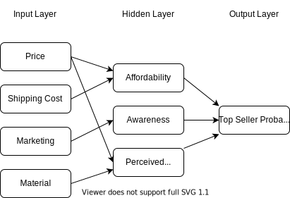
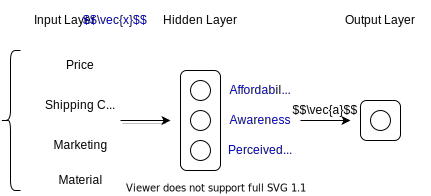

# Welcome!
* Learn about neural networks and decision trees
* Practice advice: When to collect more date or get a large CPU
* Week 1: Inference (prediction)
* Week 2: Training
* Week 3: Practical advice
* Week 4: Decision Trees

# Neurons and the Brain
* Neural Networks were based on how the human brain works
* Good applications: Speech recognition, images, NLP
* **Main Idea**: A neuron receives multiple input from other neurons then outputs or fires a connection to other neurons
* Nowadays neural networks have shifted away from the its biological neuron origin
* We have more and more data now but with that the performance has more been going up with traditional AI approaches (Linear Regression)
* GPUs turn out to be really useful in deep-learning

# Demand Prediction
* Problem: We are selling tee-shirts and what to find whether they with become top sellers
    * Input: price
    * Output: (1/0) is it a top seller
    * We could use a sigmoid function!
* Sigmoid formula: $$a = \frac1{1 + e^{-(wx+b)}}$$
* **Neuron** abstraction:
    * Input ($x$): The price
    * Output ($a$): The activation value -> probability of being a top-seller
    * $a$ is computed using the sigmoid function
* New problem: Expanding on the tee-shirt scenario
    * Output: Probability of being a top seller
    * Input: price, shipping cost, marketing, material
* Neural networks visualization

    
* The "activation" is the number sent out from a neuron. For example the affordability, awareness, and perceived quality are activations of the hidden layer.
* Updated network: In practice we can't individually enter which neurons are connected to which other neurons.

    
* You could say: Neural networks "learn" their own features for logistic regression
* Next there are for tips to set the number of hidden layers and number of neurons in each layer

# Example: Recognizing Images
* Let's look at the face recognition problem: Train a neural network to output the identity of a person given and 1000 x 1000 picture or 1 million brightness values.
* Using 3 different layers: See [page 17](Lecture.pdf)
    1. The first layer look for small lines or edges in certain orientations
    2. The second layer looks for facial features (nose, ear, eyes, ...)
    3. Third layer tries piece together the entire face
* A similar situations happens if you feed imaged of cars
* Conclusion: The neural network adapts based on the data given to it

# Discourse community
Discourse [Link](https://community.deeplearning.ai)

# Quiz: 100%
Quiz [file](Quizzes.md#neural-networks-intuition)