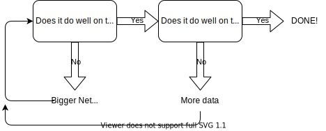

# Diagnosing Bias and Variance
* With different models you might underfit or overfit, how do you check if either of this is the case?
* Note: If there are several different features (4+) then is difficult to plot.
* Three different possibilities:
    * **High bias (underfit)**: $J_\text{train}$ and $J_\text{cv}$ are high. Example: $f_{\vec{w},b}(\vec{x}) = w_1x_1 + b$.
    * **"Just right"**: $J_\text{train}$ and $J_\text{cv}$ are low. Example: $f_{\vec{w},b}(\vec{x}) = w_1x_1 + w_1x^2 + b$.
    * **High variance (overfit)**: $J_\text{train}$ is low but $J_\text{cv}$ is high. Example: $f_{\vec{w},b}(\vec{x}) = w_1x_1 + w_2x^2 + w_3x^3 + w_4x^4 + b$.
* If we plot $J_\text{cv}$ and $J_\text{train}$, on a graph where the x-axis is the degree of the polynomial:
    * $J_\text{train}$ will approach 0 with higher and higher degrees.
    * $J_\text{cv}$ will have an arc shape where either end is high and the middle is low.
    * See [page 21](Lecture.pdf).
* Diagnosing bias and variance:
    * High bias (underfit): $J_\text{train}$ is high and $J_\text{train} \approx J_\text{cv}$.
    * High variance (overfit): $J_\text{cv} \gg J_\text{train}$ ($J_\text{train}$ may be low).
    * High variance and High bias (not often): $J_\text{train}$ is high and $J_\text{cv} \gg J_\text{train}$.

# Regularization and Bias/Variance
* How does the regularization value $\lambda$ (lambda) effect the bias/variance
* Model: $f_{\vec{w},b}(\vec{x}) = w_1x + w_2x^2 + w_3x^3 + w_4x^4 + b$
    $$J(\vec{w},b) = \frac1{2m} \sum_{i=1}^m \left( f_{\vec{w},b}(\vec{x}^{(i)}) - y^{(i)} \right)^2 + \frac\lambda{2m} \sum_{j=1}^n w_j^2$$
* If $\lambda$ is very large: High bias (underfit) - the model is ~straight
* If $\lambda$ is very small: High variance (overfit) - the model is very curvy
* Choosing regularization parameter $\lambda$
    * Try $\lambda = 0$
    * Try $\lambda = 0.01$
    * Try $\lambda = 0.02$
    * Try $\lambda = 0.04$
    * $\vdots$
    * Try $\lambda = 10$

    Evaluate the performance of each lambda on the cross validation set. Find $(\vec{w}, b)$ to $\min_{\vec{w},b} J(\vec{w},b)$ over tested values of $\lambda$. Find $J_\text{cv}(\vec{w},b)$ based the resulting $(\vec{w}, b)$ values. The the value of $\lambda$ that $\min_\lambda J_\text{cv}(\vec{w},b)$ and report back the error of $J_{test}$
* Plotting $J_\text{cv}$ and $J_\text{train}$, on a graph where the x-axis is $\lambda$:
    * $J_\text{train}$ will start low and increase as $\lambda$ increases.
    * $J_\text{train}$ will be high on either extreme and will have an arc, lowest in the middle.
    * See [page 26](Lecture.pdf)

# Establishing a Baseline Level of Performance
* Problem: Speech Recognition - convert an audio to text
* Error baseline:
    * Training error: 10.8%
    * Cross validation error: 14.8%
    * Human's performance level (baseline): 10.6%
* Looking at the baseline we can see that this problem has more of a variance problem then a bias problem
* A good way to get a baseline of performance:
    * how well can humans do this task
    * competing algorithm's performance
    * Guess based on prior experience
* Note:
    * The gap between baseline and training error tells if you have high bias
    * The gap between training error and cv error tells if you have high variance

# Learning Curves
* You can graph the error ($J_\text{train}$ and $J_\text{cv}$) against the number of training examples
    * $J_\text{train}$ error will increase will more training examples
    * $J_\text{train}$ error will decrease will more training examples
    * See [page 32](Lecture.pdf) for the charts
* Graphing error (vs. $m_\text{train}$) for a model with high bias

    $J_\text{train}$ will increase and then flatten out quickly. $J_\text{cv}$ will look like a mirror image. See [page 33](Lecture.pdf). Note the baseline will be much lower then where $J_\text{train}$ and $J_\text{cv}$ are.
* Graphing error (vs. $m_\text{train}$) for a model with high variance

    $J_\text{train}$ and $J_\text{cv}$ will have a large gap between them. The baseline error might even be in between these two curves. See [page 34](Lecture.pdf). By increase the training set size, the $J_\text{train}$ and $J_\text{cv}$ will move close to the baseline performance.

# Deciding What to try Next Revisited
* Problem: linear regression for predicting housing prices
    $$J(\vec{w},b) = \frac1{2m} \sum_{i=1}^m \left(f_{\vec{w},b}(\vec{x}^{(i)})-y^{(i)}\right)^2 + \frac\lambda{2m} \sum_{j=1}^n w_j^2$$

    The model is giving large errors in the predictions:
    * High Variance: Get more training examples
    * High Variance: Try a smallest feature set
    * High Bias: Get additional features
    * High Bias: Adding polynomial features ($x_1^2$, $x_2^2$, $x_1x_2$, ...)
    * High Bias: Decreasing $\lambda$
    * High Variance: Increasing $\lambda$

# Bias/Variance and Neural Networks
* Larger neural networks have lower bias!
* Model for how to deal with bias / variance in neural networks: See [page 39](Lecture.pdf)

    
* Note: That larger neural networks are almost always more accurate than smaller networks if you regularize properly ($\lambda$)
* Code for regularized mode:

    Model:
    $$J(\vec{w},b) = \frac1m \sum_{i=1}^m L(f(\vec{x}^{(i)}), y^{(i)}) + \frac\lambda{2m} \sum_{j=1}^n w_j^2$$

    Code for non-regularized model:
    ```python
    layer_1 = Dense(units=25, activation='relu')
    layer_2 = Dense(units=15, activation='relu')
    layer_3 = Dense(units=1, activation='sigmoid')
    model = Sequential([layer_1, layer_2, layer_3])
    ```

    Code for regularized model:
    ```python
    layer_1 = Dense(units=25, activation='relu', kernel_regularizer=L2(0.01))
    layer_2 = Dense(units=15, activation='relu', kernel_regularizer=L2(0.01))
    layer_3 = Dense(units=1, activation='sigmoid', kernel_regularizer=L2(0.01))
    model = Sequential([layer_1, layer_2, layer_3])
    ```

# Quiz: 100%
Quiz [file](Quizzes.md#bias-and-variance)